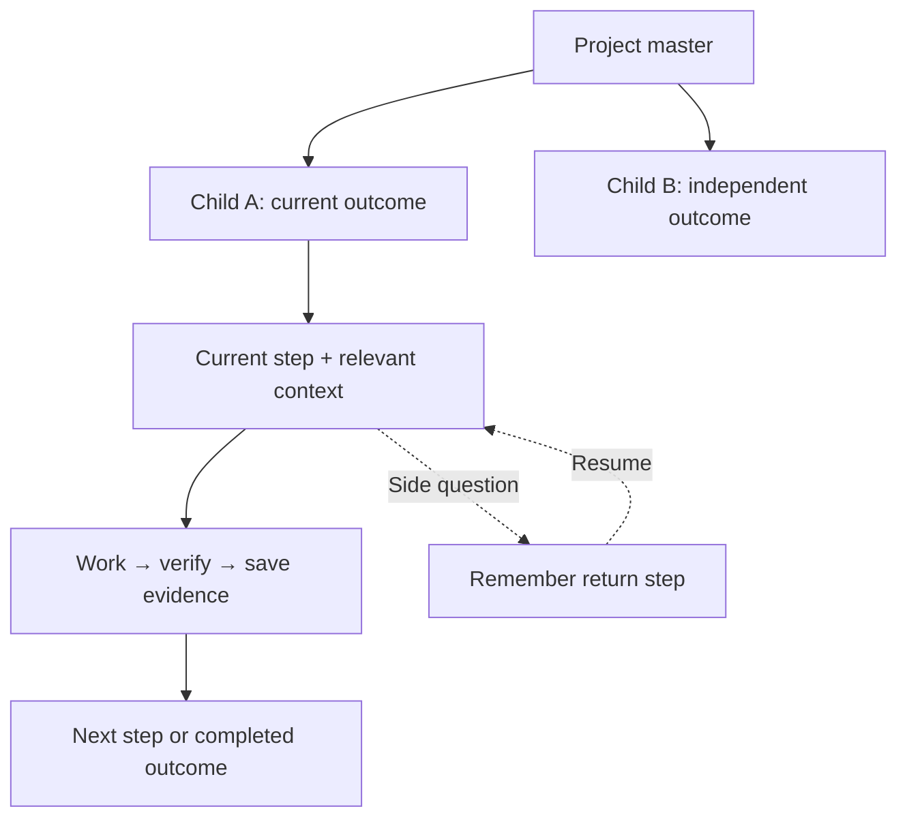

<div align="center">

<picture><source media="(prefers-color-scheme: dark)" srcset="assets/brand/opencntx-wordmark-dark.svg"></picture>

**Keep your project knowledge. Give AI just what it needs.**

Local first · Any model · Your files, your decisions · **v1.7.4 Stable**

[Get started](docs/start-here.md) · [Documentation](docs/README.md) · [Roadmap](docs/roadmap.md) · [Releases](docs/releases.md) · [Support](SUPPORT.md)

</div>

You should not have to explain your project from scratch in every new AI conversation. Keep useful knowledge locally, select the context for one task, and retain a clear place to resume.

## Three places, three clear jobs


| Place | What belongs there? | Why it helps |
|---|---|---|
| **Local workspace — the original** | Context, sources, decisions, skills and agent instructions, technical knowledge, evidence and roadmaps. | Knowledge survives a closed chat; you control the files. |
| **GitHub — a recommended remote copy** | Selected files and version history, usually in a private repository. | Recover a reviewed version or continue elsewhere. Configure Git and synchronization separately. |
| **A notes app — your readable view** | Simple explanations, linked knowledge, progress and roadmaps. | Understand the project without reading technical logs. Use Obsidian or another Markdown-friendly app. |

GitHub holds only committed and pushed files; keep separate backups for untracked, large or sensitive data. Never put private knowledge in a public repository. The notes app is a presentation layer, not a second OPENCNTX store. Your AI host decides how to use stored skills and instructions; installing OPENCNTX does not automatically enable GitHub or notes-app synchronization.

## From a question to a finished step


1. **Choose the next task:** goal, current step and relevant decisions.
2. **Give AI useful context:** preview selected files and build a small package.
3. **Work and check:** you or your AI tool perform the task and verify the result.
4. **Save and continue:** record evidence and preserve the next step.

OPENCNTX packages and verifies files. Optional workspace and continuity tools organize durable task state; the installed package does not run an AI or automatically interpret chat intent.

## Small fix or mega project?

Task size sets the level of detail. **Its relationship to the existing goal determines whether a new child roadmap is needed.**

| Work size | Example | Follow-up |
|---|---|---|
| **Small** | A setting or paragraph. | One check in the relevant existing roadmap; verify and close. |
| **Medium** | A few connected changes. | A short prepare → implement → check checklist in the active roadmap. |
| **Large** | An independent feature or migration. | A child roadmap for a distinct outcome; extend the current child for related work. |
| **Mega** | Several independent deliverables. | One master, child roadmaps, dependencies and evidenced checkpoints. |



A new chat resumes saved work; it does not by itself require another roadmap. Your host must connect its work to the saved state. [Roadmap rules](docs/project-roadmaps.md) · [Continuity example](docs/continuity.md)

## A knowledge base you can actually read


**What are we doing? What is done? What happens next? Where is the explanation?** Keep those answers in the foreground and technical evidence one link away. This is a suggested notes-app layout, not a bundled dashboard or automatic Obsidian integration. [Explore the visual tour](docs/visual-tour.md).

## Start in minutes

With Python 3.11–3.14, Git and pipx available:

```powershell
pipx install "git+https://github.com/CNTX-PROJECT/OPENCNTX.git@v1.7.4"
opencntx --version
```

Inside a small project:

```powershell
opencntx init
opencntx pack --preview
opencntx pack
opencntx verify
```

Choose files in `opencntx.toml` and inspect `.opencntx/latest/CONTEXT.md` before sharing. [Get started](docs/start-here.md) covers installation, configuration and removal. No account, API key or built-in model is required.

## Go deeper when you need to

| Question | Guide |
|---|---|
| How does a context package work? | [How it works](docs/how-it-works.md) |
| Where do knowledge, instructions and tasks live? | [Workspace](docs/workspace.md) |
| Which command or recovery route do I need? | [Commands](docs/commands.md) · [Troubleshooting](docs/troubleshooting.md) |
| What is delivered versus planned? | [Releases](docs/releases.md) · [Roadmap](docs/roadmap.md) |

Verification proves matching bytes, not truth or task success. You decide what leaves your computer. [Security](docs/security.md) · [Private vulnerability reporting](SECURITY.md)

[Support](SUPPORT.md) · [Contributing](CONTRIBUTING.md) · [Visual system](docs/visual-system.md) · [Changelog](CHANGELOG.md) · [Apache-2.0](LICENSE)
