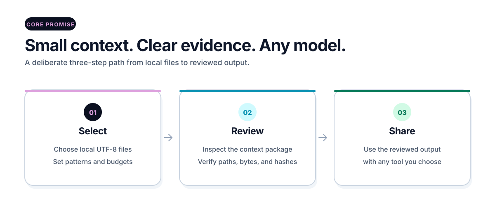

<div align="center">

# OPENCNTX

<picture>
  <source media="(prefers-color-scheme: dark)" srcset="assets/brand/opencntx-wordmark-dark.svg">
  
</picture>

**Turn selected local files into a small, reviewable context package—with exact byte evidence.**

**v1.2.1** · **Local first** · **Any model** · **Zero runtime dependencies**

[Get started](docs/start-here.md) · [How it works](docs/how-it-works.md) · [Workspace](docs/workspace.md) · [Commands](docs/commands.md) · [Security](docs/security.md) · [All guides](docs/README.md)

</div>

OPENCNTX helps you give an AI tool the context it needs—without handing over an
entire project. It can also keep one roadmap, one current detail and one
restart-safe history outside the chat, so a long assignment does not depend on
AI memory. You choose the files and roadmap; OPENCNTX keeps the local evidence.

It needs no account, API key, cloud service, database, or built-in AI model.
OPENCNTX never uploads files and never sends a prompt for you.

| What you control | What OPENCNTX proves | What it never decides |
|---|---|---|
| Goal, files, limits, and sharing | Paths, sizes, hashes, budgets, and later drift | Truth, safety, approval, or which AI to use |

<picture>
  <source media="(prefers-color-scheme: dark)" srcset="assets/docs/opencntx-overview-dark.svg">
  
</picture>

## Quick start

You need Python 3.11, 3.12, 3.13, or 3.14 on Windows or Ubuntu. With Git and
`pipx` installed, install the exact v1.2.1 release in one command:

```powershell
pipx install "git+https://github.com/CNTX-PROJECT/OPENCNTX.git@v1.2.1"
opencntx --version
```

Prefer a full source checkout instead:

```powershell
git clone --branch v1.2.1 --depth 1 https://github.com/CNTX-PROJECT/OPENCNTX.git
cd OPENCNTX
python -m pip install .
```

Contributors who deliberately need the current source can clone `main`:

```powershell
git clone --depth 1 https://github.com/CNTX-PROJECT/OPENCNTX.git
```

Inside a small project, run:

```powershell
opencntx init
opencntx pack --preview
opencntx pack
opencntx verify
```

The flow is deliberately simple:

1. **Initialize** — create `opencntx.toml` with one clear goal and file rules.
2. **Preview** — see what would be included, excluded, or blocked; write nothing.
3. **Pack and inspect** — read `.opencntx/latest/CONTEXT.md` yourself.
4. **Verify** — confirm that the package and recorded source bytes still match.
5. **Share by choice** — provide reviewed output to another tool only if you want to.

```text
.opencntx/latest/
├── CONTEXT.md      # the text you review
└── manifest.json   # paths, sizes, and SHA-256 hashes
```

`verify` proves byte identity. It does not prove that the content is correct,
complete, safe, or approved. Follow [Get started](docs/start-here.md) for the
complete Windows and Ubuntu guide, configuration example, upgrade, removal,
and common errors.

<picture>
  <source media="(prefers-color-scheme: dark)" srcset="assets/docs/core-flow-dark.svg">
  
</picture>

## Three local ways to work

| Route | Best for | Start with |
|---|---|---|
| **Core package** | One question or one small task | `init → preview → pack → inspect → verify` |
| **Structured workspace** | Longer projects that need sources, reviewed knowledge, task gates, and recovery evidence | `opencntx workspace init PROJECT` |
| **Roadmap flow** | A complete bounded roadmap that must survive restarts with one approval | `opencntx flow start roadmap.json --approval "AUTO PILOT"` |

The workspace is **Stable and optional**. It adds local source capture,
chapters, a catalog, tasks, playbooks, roles, bounded executor packages,
transaction diagnosis, and backup-first recovery. It does not start an AI,
agent, shell process, OCR tool, transcription service, or cloud sync.

The additive [roadmap flow](docs/continuity.md) automatically stores the
roadmap, current detail, compact context, receipts and history locally. After a
PASS it returns to the roadmap and triggers the next dependency-ready detail
without a new approval. Optional private Git/GitHub sync is filtered,
previewed, non-force and read back; local storage remains canonical.

Read [Workspace](docs/workspace.md) when a single context package is no longer
enough. Beginners can stay entirely on the core route.

## Safety at a glance

- Only selected local UTF-8 text inside the project boundary is read.
- Known credential paths are excluded before reading.
- A small local scanner blocks narrow high-confidence secret signals and warns
  on broader signals; it cannot prove that output is secret-free.
- Privacy labels classify local content. They do not encrypt it.
- A non-zero exit code means the requested result was not fully proven.
- Sharing is always a separate human decision.

Read [Security in plain language](docs/security.md) before using private data.
The root [Security Policy](SECURITY.md) is the exact technical boundary. Report
a possible vulnerability privately through GitHub's **Report a vulnerability**
route—never in a public issue.

## Find the right guide

| I want to… | Read |
|---|---|
| install OPENCNTX and create a first package | [Get started](docs/start-here.md) |
| understand the mental model | [How it works](docs/how-it-works.md) |
| use the longer-project workflow | [Workspace](docs/workspace.md) |
| look up an exact CLI path | [Command reference](docs/commands.md) |
| solve an error | [Troubleshooting](docs/troubleshooting.md) |
| understand privacy and safety | [Security](docs/security.md) |
| review the locally tested next-workflow candidate | [Adaptive AI workflow candidate](docs/adaptive-ai-workflow.md) |
| browse every guide | [Documentation home](docs/README.md) |

## Current public state

| Item | Proven state |
|---|---|
| Release | `v1.2.1` Production/Stable, immutable GitHub Release; all earlier releases remain immutable |
| Package | `opencntx 1.2.1` |
| Python | 3.11, 3.12, 3.13, and 3.14 |
| Tested systems | Windows and Ubuntu |
| CI | `CI_ACTIVE`; eight required live Windows/Ubuntu and Python jobs |
| Runtime dependencies | none |
| Distribution | exact Git tag and four verified GitHub Release assets; no PyPI/TestPyPI package |
| License | [Apache-2.0](LICENSE) |

The immutable Release contains exactly:

- `opencntx-1.2.1-py3-none-any.whl`
- `opencntx-1.2.1.tar.gz`
- `SHA256SUMS`
- `BUILD-RECORD.json`

See [Release artifacts](docs/release-artifacts.md) for the exact build and
verification boundary.

## Project routes

- Changes and release history: [CHANGELOG.md](CHANGELOG.md)
- Questions and reproducible bugs: [SUPPORT.md](SUPPORT.md)
- Contributions and local checks: [CONTRIBUTING.md](CONTRIBUTING.md)
- Completed milestones: [Public roadmap](docs/roadmap.md)
