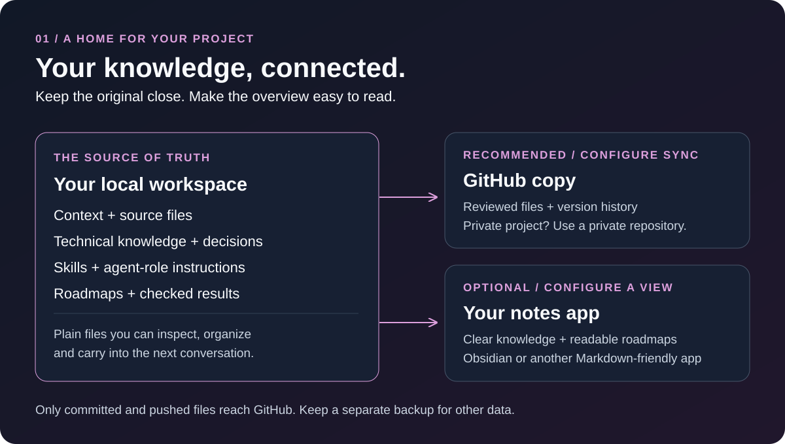
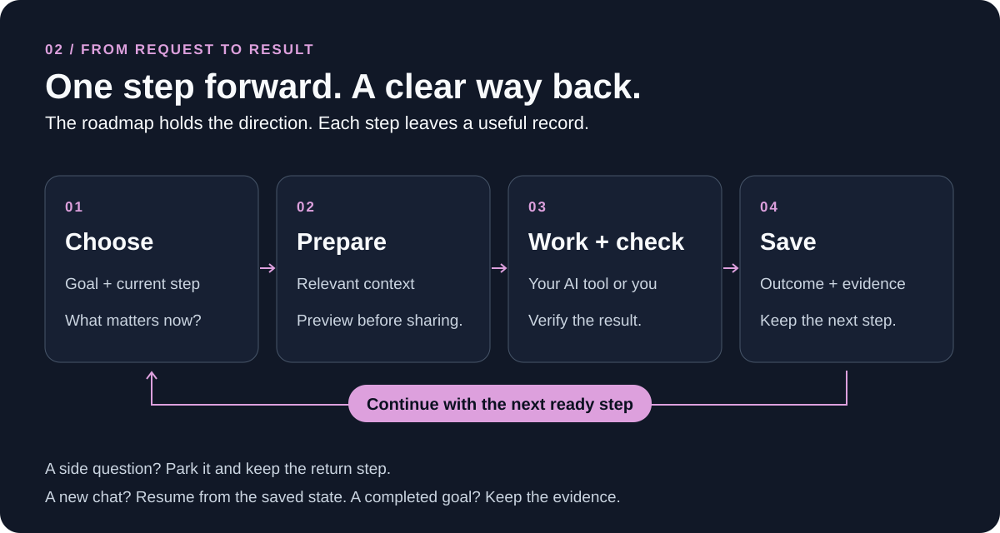
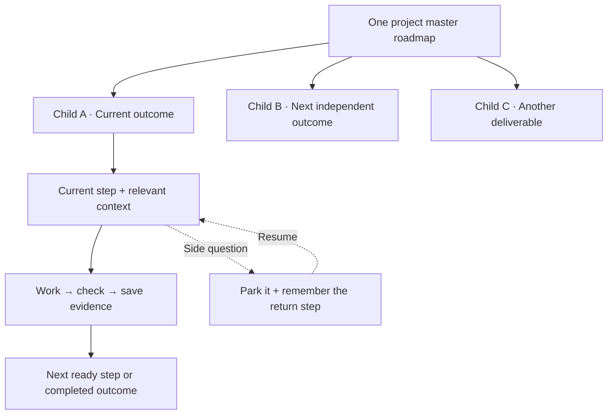
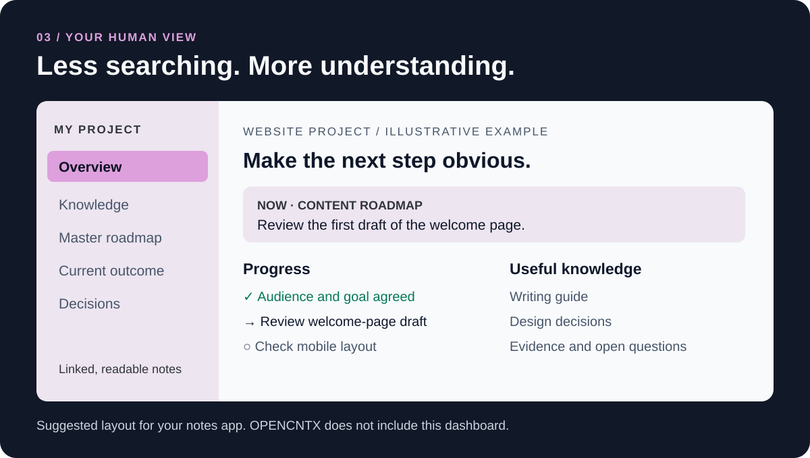

<div align="center">

<picture>
  <source media="(prefers-color-scheme: dark)" srcset="assets/brand/opencntx-wordmark-dark.svg">
  
</picture>

**Keep your project knowledge. Give AI just what it needs.**

Local first · Any model · Your files, your decisions

[Start here](docs/start-here.md) · [Visual tour](docs/visual-tour.md) · [Project roadmaps](docs/project-roadmaps.md) · [All guides](docs/README.md)

</div>

You should not have to explain your project from scratch every time you open a
new AI conversation. OPENCNTX helps you keep useful knowledge in local files,
select a small context package for the next task, and preserve progress outside
the chat.

**Available now:** [v1.7.4 Stable release](https://github.com/CNTX-PROJECT/OPENCNTX/releases/tag/v1.7.4).
[What is included](docs/release-1.7.4.md) · [What comes next](docs/roadmap.md)

## Your project, in three places



| Place | What it contains | Why it helps |
|---|---|---|
| **Your computer — the original** | Context, source files, technical knowledge, decisions, reusable instructions, task evidence and roadmaps. | Knowledge survives a closed chat. You control the files. |
| **GitHub — a recommended remote copy** | Selected project files and their version history, usually in a private repository. | Recover a reviewed version or continue on another computer. Set up Git and synchronization separately. |
| **A notes app — your readable view** | Short explanations, linked knowledge, completed work, open questions and roadmaps. | See where the project stands without reading technical logs. Obsidian or another Markdown-friendly app can serve this role. |

Think of GitHub as a versioned off-machine copy: only committed and pushed files
are there. It complements a separate backup for untracked files and large or
sensitive data. Keep private project knowledge out of public repositories.

The local workspace is canonical. The notes app is an optional presentation
layer; it does not need another OPENCNTX store. Skills and agent instructions
can be stored as documents; your AI host decides how to use or run them.
GitHub sync and notes-app updates are integrations you configure, not services
enabled automatically by installing OPENCNTX.

## From a question to a finished step



1. **Choose the next task.** Start with the goal, current step and relevant decisions.
2. **Give AI the useful context.** Preview selected files and build a small, readable package.
3. **Work and check.** Your AI tool or you carry out the task and test the result.
4. **Save and continue.** Record the outcome and evidence, update the roadmap, and preserve where to resume.

OPENCNTX packages and verifies files. Its optional workspace and continuity
tools help organize durable task state. Your AI tool performs the work; the
installed package does not run an AI or automatically understand chat intent.

## Small fix or mega project? Keep one clear direction.

The structure grows with the work. Size helps plan the detail; **the relationship
to the existing goal decides whether a new child roadmap is needed**.

| Work size | Example | Roadmap and follow-up |
|---|---|---|
| **Small** | Correct a setting or improve one paragraph. | Add one check to the relevant existing roadmap. Verify and close it. |
| **Medium** | Add a feature with a few connected steps. | Keep a short checklist in the active roadmap: prepare, implement, check, finish. |
| **Large** | Deliver an independent new feature or migration. | Create a child roadmap under the project master for a distinct outcome; extend the current child when it is related work. |
| **Mega** | Build a product with several independent deliverables. | Use one master with child roadmaps per outcome, explicit dependencies and checkpoints. Each child identifies its current step and evidence. |



A new chat resumes the saved current step. A side question retains a return
anchor. Related work stays together; a new conversation alone does not create
a new roadmap. Completion is recorded with evidence, and blockers remain visible.

[See the roadmap rules](docs/project-roadmaps.md) ·
[Follow a complete continuity example](docs/continuity.md)

## A knowledge base you can actually read



A useful overview answers four questions: **What are we doing? What is done?
What happens next? Where is the explanation?** Keep readable summaries and
linked notes in the foreground, with technical records available when needed.

The illustration is a suggested layout for your own notes app, not a bundled
dashboard or an automatic Obsidian integration.
[Explore the visual tour](docs/visual-tour.md) · [Organize a workspace](docs/workspace.md)

## Start in minutes

With Python 3.11–3.14, Git and pipx available:

```powershell
pipx install "git+https://github.com/CNTX-PROJECT/OPENCNTX.git@v1.7.4"
opencntx --version
```

Inside a small project:

```powershell
opencntx init
opencntx pack --preview
opencntx pack
opencntx verify
```

Choose files in `opencntx.toml`, preview the selection, and inspect
`.opencntx/latest/CONTEXT.md` before sharing it.
The [getting-started guide](docs/start-here.md) covers installation,
configuration, updates and removal. No account, API key or built-in model is required.

## Go deeper when you need to

| Your next question | Guide |
|---|---|
| What exactly is a context package? | [How it works](docs/how-it-works.md) |
| Where do knowledge, instructions and tasks live? | [Workspace](docs/workspace.md) |
| How do I resume work across conversations? | [Continuity](docs/continuity.md) |
| What command do I use? | [Commands](docs/commands.md) · [Troubleshooting](docs/troubleshooting.md) |
| What is delivered, and what is still planned? | [Releases](docs/releases.md) · [Product roadmap](docs/roadmap.md) |

Verification proves matching bytes, not the truth of a document or the success
of a task. You decide what leaves your computer.
[Security in plain language](docs/security.md) · [Private vulnerability reporting](SECURITY.md)

[Support](SUPPORT.md) · [Contributing](CONTRIBUTING.md) ·
[Visual system](docs/visual-system.md) · [Changelog](CHANGELOG.md) · [Apache-2.0](LICENSE)
