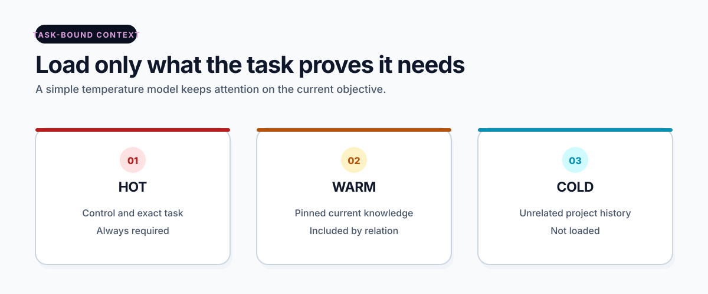

# Context navigation

[Overview](../README.md) · [Get started](start-here.md) · [How it works](how-it-works.md) · [Workspace](workspace.md) · [Commands](commands.md) · [Security](security.md) · [All guides](README.md)

> **Stable and optional:** this page is for structured workspaces. The core
> package route does not require tasks, chapters, or context navigation.

The context navigator builds one deterministic package for one approved task.
It follows explicit pins instead of searching or guessing across the whole
workspace.

<picture>
  <source media="(prefers-color-scheme: dark)" srcset="../assets/docs/context-selection-dark.svg">
  
</picture>

## Three context temperatures

### Hot

Always needed for the active task:

- OWNER and current control files;
- the active task record;
- exact current state.

### Warm

Loaded only through approved relationships:

- current accepted chapters;
- approved playbook and role;
- explicitly referenced source records and bytes.

### Cold

Left outside the task package:

- unrelated chapters;
- previous task history;
- unselected sources;
- old roadmap text outside the marked current block.

## Build context

For a valid task in `IN_EXECUTION`:

```powershell
opencntx workspace context build TASK-EXAMPLE-0001 `
  --proposal-digest PROPOSAL_DIGEST_HERE `
  --max-files 25 `
  --max-bytes 100000 `
  --root my-project
```

Use the exact identifiers and digests required by the CLI output and task
record. The builder checks control state, task state, catalog freshness,
chapter pins, privacy restrictions, and byte budgets before publication.

## Compact roadmap snapshot

When the roadmap contains the exact supported markers, context building
refreshes a deterministic snapshot of the marked current block. The task pins:

- the full roadmap digest;
- the marker block digest;
- the derived snapshot digest.

Older workspaces without markers keep the legacy full-roadmap behavior.

## Verify while the task is active

```powershell
opencntx workspace context verify TASK-EXAMPLE-0001 `
  --proposal-digest PROPOSAL_DIGEST_HERE `
  --root my-project
```

Live context verification is intended while the task remains `IN_EXECUTION`
and before result submission. After closure, use the preserved append-only
task chain and recorded digests as historical evidence.

## No semantic search

The navigator has no embeddings, vector database, ranking model, knowledge
graph, or AI summary. Its small result comes from explicit relationships and
hard budgets.

## Related pages

- [Context packages](context-packets.md)
- [Chapters and catalog](chapters-and-catalog.md)
- [OWNER flow](owner-flow.md)
- [Security](security.md)

[Documentation home](README.md)
