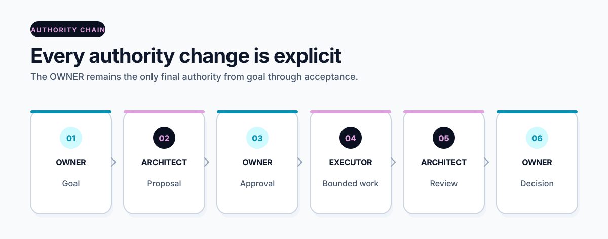

# OWNER flow

[Overview](../README.md) · [Get started](start-here.md) · [How it works](how-it-works.md) · [Workspace](workspace.md) · [Commands](commands.md) · [Security](security.md) · [All guides](README.md)

> **Stable and optional:** this task lifecycle belongs to the workspace route.
> The core package route does not require roles, approvals, or task records.

The workspace can record one task from goal to accepted result without letting
the tool approve its own work.

<picture>
  <source media="(prefers-color-scheme: dark)" srcset="../assets/docs/owner-flow-dark.svg">
  
</picture>

## Roles in plain language

- **OWNER:** states the goal and makes the final approval and acceptance
  decisions.
- **ARCHITECT:** analyzes the project, proposes a bounded task, prepares the
  execution context, and reviews the result.
- **Bounded executor:** works only inside the approved task, playbook, role,
  and context package.

OPENCNTX records this flow. It is not itself any of these people or agents.

## Exact order

```text
OWNER goal
→ ARCHITECT analysis and proposal
→ exact OWNER proposal approval
→ task begins
→ context and executor package
→ bounded result
→ ARCHITECT review
→ exact OWNER result decision
→ task closure
```

## 1. Prepare playbook and role

Register the exact method and allowed actions. Review their definition digests.
Approve each revision separately before task execution.

Use the relevant `workspace playbook ...` and `workspace role ...` commands
from the [command reference](commands.md).

## 2. Propose one task

```powershell
opencntx workspace task propose TASK-EXAMPLE-0001 `
  --title "Review one source" `
  --goal "Compare the source with the accepted chapter" `
  --done "Write one bounded review with cited source evidence" `
  --executor-role "DOCUMENT_REVIEWER" `
  --input CONTROL/OWNER.md `
  --input CONTROL/ROADMAP.md `
  --input CONTROL/CURRENT.md `
  --allow "read approved task inputs" `
  --forbid "modify sources or grant approval" `
  --expected-output "one Markdown review" `
  --acceptance "every finding cites an approved input" `
  --architect ARCHITECT `
  --root my-project
```

Add only the exact allowed inputs required by the real task. The proposal pins
their digests. A proposal is not approval.

## 3. Approve and begin separately

The OWNER approves the exact task ID, revision, and proposal digest. Only then
can the task enter `APPROVED` and subsequently `IN_EXECUTION`.

The workspace allows only one non-terminal task at a time.

The [v1.3.0 adaptive-workflow candidate](adaptive-ai-workflow.md) adds a
provider-neutral host contract that first asks whether approval covers only
the current assignment or the bounded remaining roadmap. Clickable controls
and copyable CLI text have identical authority; displaying either is not
approval. Stable v1.2.1 workspace commands retain the flow documented here.

## 4. Rebuild knowledge and build context

After the last official source or chapter change:

```powershell
opencntx workspace catalog rebuild --root my-project
```

Build task context only when all required chapters are technically `CURRENT`
and content-approved for the task.

## 5. Verify live context before the result

While the task is still `IN_EXECUTION`:

1. verify the task-bound context;
2. verify the executor package;
3. inspect the assignment and permitted actions;
4. only then submit the bounded result.

This order avoids treating an old snapshot as live authority.

## 6. Result and review

The executor submits one result object and separate evidence. The ARCHITECT
reviews the exact result digest and records `PASS`, `FAIL`, or the defined
review outcome without accepting on behalf of the OWNER.

## 7. OWNER decision and closure

The OWNER accepts, returns, or rejects the exact result and review objects.
Closure is allowed only after the required accepted decision.

After closure, verify the append-only task chain, result, evidence, and executor
status as historical proof. Do not expect live `IN_EXECUTION` context status.

## Fail-closed and anti-deadloop behavior

- A wrong digest, state, revision, or input stops the operation.
- One failed attempt records controller-derived facts and copied local evidence.
- Its fingerprint uses command type, target, relevant input digests, exit
  status, and one fixed error class; changing prose does not change it.
- A later attempt needs changed relevant input bytes or uniquely new evidence.
- OPENCNTX does not retry automatically.
- Three equal fingerprints anywhere in the task, five total attempts, 25
  cumulative actions, or 30 cumulative minutes make the task visibly
  `BLOCKED`.
- A block has no in-place reset. The OWNER may cancel it or explicitly
  supersede it with one new task ID.

Recorded action and duration values are local statements because OPENCNTX does
not run the external command. Their validation, digest binding, totals, and
block decision are reproducible; their real-world truth is not automatically
attested.

## Related pages

- [Playbooks and roles](playbooks-and-roles.md)
- [Context navigation](context-navigation.md)
- [Chapters and catalog](chapters-and-catalog.md)
- [Security](security.md)

[Documentation home](README.md)
