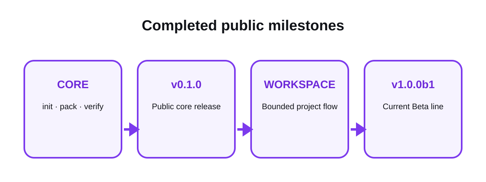

# Public roadmap

[Overview](../README.md) · [Get started](start-here.md) · [How it works](how-it-works.md) · [Workspace](workspace.md) · [Commands](commands.md) · [Security](security.md) · [All guides](README.md)

This page reports completed public facts. It does not promise unapproved
features or expose private project records.

<picture>
  <source media="(prefers-color-scheme: dark)" srcset="../assets/docs/roadmap-dark.svg">
  
</picture>

## Completed foundation

### Reset and small runnable core

- established the OPENCNTX project and provider-neutral boundary;
- added `init`, `pack`, and `verify`;
- proved the core flow on Windows and Ubuntu.

### Public v0.1.0

- released the deterministic three-command context package flow;
- documented explicit includes, exclusions, budgets, hashes, and drift;
- kept AI, network, cloud, GUI, and provider integrations out of scope.

### Workspace foundation

- byte-exact source capture and receipts;
- chapter revisions and replaceable local catalog;
- append-only tasks with separate OWNER gates;
- deterministic task-bound context navigation;
- safe registration of already derived UTF-8 text;
- proposed and approved playbooks and roles;
- bounded executor packages that do not start execution;
- compact current control snapshot for large roadmaps.

### Public v0.2.0

- released the complete current workspace foundation;
- activated six-job Windows and Ubuntu CI;
- added strict `main` protection and immutable release evidence;
- published security, community, documentation, and brand surfaces.

### Verifiable release preparation

- added clean, independent wheel and sdist candidate builds;
- separated byte-identical wheel proof from content-identical sdist proof;
- added exact SHA-256 and unsigned build-record verification;
- exercised install, core smoke, and uninstall on all six existing CI jobs;
- documented one pinned `pipx` route and kept publication behind a separate
  explicit decision.

### Local workspace transaction integrity

- added local single-writer workspace and task locks with exact state CAS;
- added durable transaction intent, phase, completion, and recovery evidence;
- added read-only interrupted-state diagnosis and explicit backup-first
  recovery bound to transaction ID and intent SHA-256;
- added real multiprocess conflict and forced-process-crash tests;
- centralized symlink, junction/reparse, containment, and directory-flush
  handling without adding a runtime dependency.

### Objective attempt and deadloop evidence

- replaced new free-text failure signatures with deterministic fingerprints
  from command, target, input-digest, exit-status, and error-class facts;
- bound attempts to one verified executor package, context manifest, allowed
  action, and copied local evidence;
- required digest-backed changed input or unique new evidence for a later
  attempt;
- added fixed semantic-repeat, total-attempt, cumulative-action, and
  cumulative-duration blocks with read-only status explanations;
- kept historical text attempts readable and kept execution, retry, truth
  attestation, and cryptographic identity outside the product claim.

### Privacy, storage, and format lifecycle

- added read-only trust, permission, privacy, storage, and compatibility
  evidence without printing original source paths or content;
- added owner-private creation defaults and physical disk-space preflights for
  bounded local writes;
- packaged versioned schemas and a compatibility matrix while keeping existing
  version-1 records unchanged and unknown future formats fail-closed;
- added explicit allowlisted cleanup with a verified external checkpoint,
  digest-bound restore, writer locking, compare-and-swap, and failure rollback;
- kept encryption, team identities, distributed locking, automatic cleanup,
  publication, and release changes outside the product claim.

### Behavior-preserving internal simplification

- retained `opencntx.cli` as the stable facade while separating six internal
  command families and reducing every function to at most 180 lines;
- centralized only byte-equivalent low-level helpers and kept domain errors,
  formats, OWNER gates, paths, output, and exit behavior unchanged;
- added exact CLI goldens, deterministic properties, selected typing, and
  branch-coverage ratchets with pinned development-only tools;
- kept the same six Windows/Ubuntu CI checks, no runtime dependency, and no
  publication, upload, product expansion, or security-audit claim.

### v0.3.0 Alpha line

- versioned the integrated post-v0.2.0 work as package `0.3.0` while retaining
  the `Development Status :: 3 - Alpha` maturity;
- kept Python `>=3.11`, zero runtime dependencies, and the existing local,
  provider-neutral product boundary;
- defined the exact-tag installation route
  `pipx install "git+https://github.com/CNTX-PROJECT/OPENCNTX.git@v0.3.0"`
  and exactly four GitHub Release assets: `opencntx-0.3.0-py3-none-any.whl`,
  `opencntx-0.3.0.tar.gz`, `SHA256SUMS`, and `BUILD-RECORD.json`;
- published v0.3.0 through its exact Git tag and matching GitHub Release.

### v1.0.0 Production/Stable line

- freezes the existing v1 public surface without adding product behavior;
- versions the package as `1.0.0` with
  `Development Status :: 5 - Production/Stable` maturity;
- keeps Python `>=3.11`, zero runtime dependencies, and the existing local,
  provider-neutral product boundary;
- defines the exact-tag installation route
  `pipx install "git+https://github.com/CNTX-PROJECT/OPENCNTX.git@v1.0.0"`
  and exactly four GitHub Release assets:
  `opencntx-1.0.0-py3-none-any.whl`, `opencntx-1.0.0.tar.gz`,
  `SHA256SUMS`, and `BUILD-RECORD.json`;
- published v1.0.0 through its exact Git tag and immutable GitHub Release;
- aligned the complete documented CLI, including the optional workspace, with
  the Production/Stable contract.

### v1.1.0 universal roadmap continuity

- added one local-first `flow` route for a complete bounded roadmap under one
  explicit `AUTO PILOT` approval;
- added a short check of only assignment-relevant existing files before every
  detail, with explicit conflict and migration classification;
- added restart-safe roadmap return and next-assignment triggering from a
  hash-chained event ledger;
- added automatic local storage for roadmaps, details, information,
  documentation, compact context, receipts and history;
- added deterministic capsule export, independent verification and restore;
- added read-only file, Git, Markdown and JSON adapters;
- added an optional filtered private Git/GitHub replica with preview,
  non-force push, conflict stop and exact remote readback;
- published exactly `opencntx-1.1.0-py3-none-any.whl`,
  `opencntx-1.1.0.tar.gz`, `SHA256SUMS` and `BUILD-RECORD.json`;
- kept `v1.0.0` immutable and preserved all existing core and workspace routes.

### v1.1.1 continuity correction

- bound roadmap, detail, and context bytes to the original flow evidence;
- counted recovery rounds per assignment and latched failed automatic sync;
- generated English-only assignment details and expanded the language guard;
- detected JSON passwords, `DB_PASSWORD`, and credential-bearing PostgreSQL
  URLs before optional private synchronization;
- added a latest-stable-tag version gate to prevent unreleased source changes
  from reusing an immutable release version;
- published exactly `opencntx-1.1.1-py3-none-any.whl`,
  `opencntx-1.1.1.tar.gz`, `SHA256SUMS` and `BUILD-RECORD.json` while preserving
  the immutable `v1.1.0` and `v1.0.0` releases.

### v1.2.0 bounded continuity and order

- added a read-only BOUNDED PERFECTION order contract and deterministic layout
  planning with exact changed-base refusal;
- added content-addressed handoffs, checkpoint receipts, capsule restoration,
  and a provider-neutral host status/claim/resume protocol;
- made optional replica behavior explicit at every PASS, FAIL, and BLOCKED
  checkpoint while preserving the canonical local store after sync failure;
- expanded universal-English and secret-policy coverage across generated
  output, database URL families, environment assignments, and exports;
- passed 459 local tests plus 100 assignments, 200 process restarts, eight
  concurrent writers, bounded recovery, and 120 layout-chaos scenarios;
- published exactly `opencntx-1.2.0-py3-none-any.whl`,
  `opencntx-1.2.0.tar.gz`, `SHA256SUMS` and `BUILD-RECORD.json` while preserving
  every earlier immutable release.

## Current state

- Current package line: `v1.2.0`
- Package version: `1.2.0`
- Maturity: Production/Stable
- Runtime dependencies: none
- CI: `CI_ACTIVE`
- Product focus: local, explicit, bounded, verifiable context and roadmap continuity
- Public release: live exact `v1.2.0` tag plus immutable matching GitHub Release;
  every earlier release remains immutable
- Distribution: exact Git tag plus the four verified GitHub Release assets
  named above; no PyPI or TestPyPI package

## Future work

No future feature is promised by this page. A next item becomes active only
after a separate bounded proposal, explicit OWNER approval, implementation,
tests, review, and merge.

Ideas are evaluated against the product boundary. AI calls, automatic agents,
cloud synchronization, OCR, transcription, embeddings, databases, GUI, MCP,
or other expansion are not implied roadmap commitments.

## Related pages

- [How it works](how-it-works.md)
- [Platforms](platforms.md)
- [Changelog](../CHANGELOG.md)
- [Contribution guide](../CONTRIBUTING.md)

[Documentation home](README.md)
