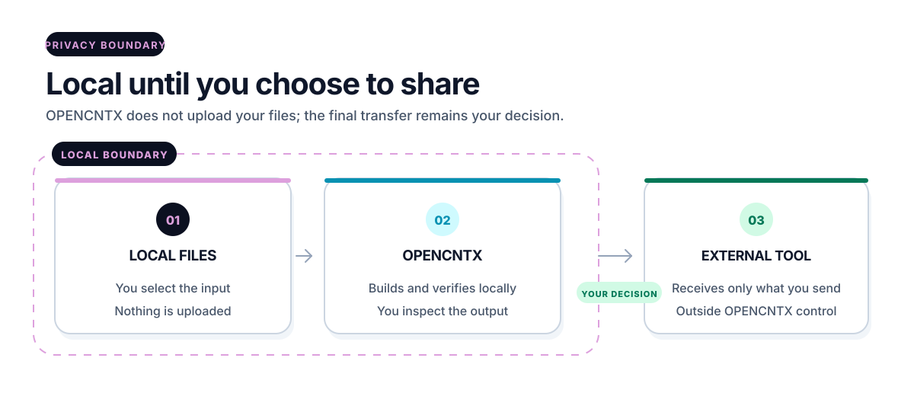

# Security in plain language

[Overview](../README.md) · [Get started](start-here.md) · [How it works](how-it-works.md) · [Workspace](workspace.md) · [Commands](commands.md) · [Security](security.md) · [All guides](README.md)

OPENCNTX helps you control context. It does not make context automatically
safe. You remain responsible for what you select, store, and share.

<picture>
  <source media="(prefers-color-scheme: dark)" srcset="../assets/docs/security-boundary-dark.svg">
  
</picture>

## Local trust boundary

The core, workspace and default roadmap flow require no network, account or API
key. They read selected local files and write local output. They do not upload
that output.

The only optional network-capable route is an explicitly configured private
Git/GitHub continuity replica. It invokes the local Git executable, never
stores a credential-bearing URL, filters candidates to bounded UTF-8 Markdown
and JSON, binds the remote head, uses a non-force push and reads the exact head
back. A failure is recorded once and latches later automatic checkpoints until
an explicit successful apply or reconfiguration clears it. The local store
remains canonical and works offline.

The boundary changes when you copy or submit the output to another tool.

## Context may contain sensitive text

Default exclusions include common Git, generated output, environment, key,
SSH identity, local credential, package registry, Docker, AWS, and
application-default credential paths. They are applied before source content
is read. They reduce risk; they do not replace inspection.

`opencntx pack --preview` shows which paths would be included, required,
excluded, or ignored and why. It also shows file and byte budgets. Preview
writes no package, manifest, receipt, temporary publication state, or source.

A small dependency-free local scanner checks only the already selected,
bounded UTF-8 text. Narrow high-confidence credential structures block pack
before publication. Broader credential-like text produces a warning. Safe
diagnostics contain finding metadata, never the matched value or snippet.

An apparent false positive can be overridden only by supplying its exact
current finding ID to `pack --allow-secret`. The ID changes with the source
bytes. There is no wildcard or permanent bypass, and an applied override is
visible as safe metadata in the manifest.

This scanner recognizes only known signals. It can miss secrets and can warn
on harmless examples. A green preview is not a guarantee that content is
secret-free.

Never place passwords, tokens, private keys, personal data, production secrets,
or content you are not allowed to share in a package or public issue.

## Privacy labels are not locks

`PUBLIC`, `INTERNAL`, `PRIVATE`, `RESTRICTED`, and `QUARANTINED` are local
classifications. They are not encryption, authentication, or access control.
Protect the workspace with appropriate operating-system and backup controls.

`workspace lifecycle status` can report observed owner-only POSIX mode bits or
direct Windows ACL access. `SAFE_OBSERVED` is evidence about the checked local
path at that moment, not encryption, authentication, protection from an
administrator, or a future guarantee. OPENCNTX does not change an existing ACL
to make the result pass. The `shared-team` profile warns because the product has
no team identity or group model.

## Supplied content stays data

Instructions inside a source, chapter, transcript, task input, or result do not
gain OWNER or roadmap authority. OPENCNTX validates structure and digests; it
does not execute supplied content.

The continuity flow binds its canonical roadmap to the first ledger event. It
reconstructs every stored assignment detail from the bound roadmap and its
hash-bound existing-check receipt, and verifies the active context against the
selection event. Changed roadmap, detail or context bytes stop later reads and
writes. These unkeyed local digests detect drift; they are not signatures and
do not defend against an administrator who deliberately rewrites all evidence.

## Fail-closed behavior

Unsafe paths, invalid UTF-8, unknown schemas, wrong digests, stale relations,
budget overflow, forbidden actions, or invalid state transitions stop the
operation. Official workspace writers additionally use local writer locks,
state compare-and-swap, and transaction evidence. An interrupted transaction
blocks later writers until read-only diagnosis and exact recovery.

Do not ignore a non-zero exit code.

Recovery never treats age or a process ID as permission to remove a lock. It
refuses an active OS lock, requires the exact transaction ID and intent digest,
backs up current known targets first, and stops on unknown data or unsafe links.
It is local recovery, not distributed locking or an OWNER decision.

Lifecycle cleanup is similarly fail-closed. It accepts only a fixed named
allowlist, verifies a new private checkpoint outside the workspace before
removal, and requires one exact preview plan and SHA-256. Restore refuses
changed checkpoint bytes or an occupied destination. Neither action is
automatic, and neither deletes original sources or authority records.

Physical disk-space checks happen before staging known writes. Free space can
change afterward, so this is a preflight rather than a reservation. File and
directory flush calls provide operating-system evidence only; they do not prove
survival across every hardware or power failure. See [Privacy, storage, and
format lifecycle](privacy-storage-lifecycle.md).

Failed-attempt fingerprints are deterministic SHA-256 bindings over recorded
facts. Free error wording is excluded, so rephrasing cannot reset the same
semantic failure count. A caller still supplies the normalized error class,
action count, and duration because OPENCNTX does not execute the external
command. These records prove bytes, classification, arithmetic, and task state;
they do not prove that the supplied real-world account is true.

Attempt result and new-evidence files remain local task artifacts. Their
content is not printed by status, but it may still contain sensitive material.
Inspect it before any manual sharing and protect the workspace with operating-
system permissions.

## Digests and approval

A digest binds a decision to exact bytes. It does not authenticate a natural
person. OWNER labels are local declarations, so protect the workspace and its
write permissions.

## What candidate CI proves

The candidate checks keep the same eight named Windows/Linux and Python
3.11-3.14 jobs. Static quality and security checks require zero unclassified
findings, type-check all runtime modules, audit pinned development
dependencies, and inspect built packages. No runtime dependency is added.

On Python 3.14, each operating-system family runs 200 deterministic writer
contention rounds, a phase-indexed crash/recovery matrix, and an upgrade from
the exact official v0.3.0 wheel. The upgrade is local and offline after the
wheel download; it checks that existing user data stays byte-identical through
upgrade and uninstall.

This is repeatable engineering evidence, not a penetration test,
certification, SLA, or claim that every future fault is impossible. A Windows
directory flush can honestly report `UNSUPPORTED`; only `VERIFIED` means the
specific operating-system call succeeded, and neither status proves survival
through every hardware or power failure.

## Deletion and provenance

Most official records are append-only. The media removal route deletes only
the exact active derived text named by a fully pinned request and preserves a
tombstone. Never automate destructive actions through a watcher.

## Report a vulnerability

Use GitHub's private **Report a vulnerability** route. Do not open a public
issue with exploit details, secrets, private source, or sensitive context.

For ordinary questions and bugs, use [Support](../SUPPORT.md). The root
[Security Policy](../SECURITY.md) is the canonical technical boundary.

[Documentation home](README.md)
