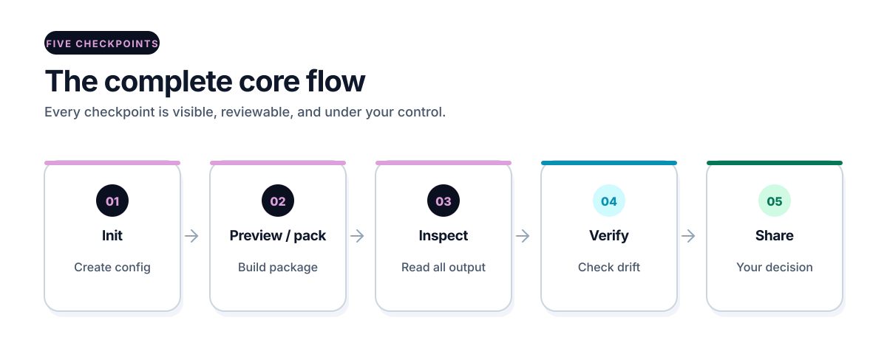

# Start here

[Overview](../README.md) · [Get started](start-here.md) · [How it works](how-it-works.md) · [Workspace](workspace.md) · [Commands](commands.md) · [Security](security.md) · [All guides](README.md)

This page covers installation and your first useful result in one continuous
path. Start with a small test project that contains only files you are allowed
to read and share.

## 1. Check the requirements

You need:

- Python 3.11, 3.12, 3.13, or 3.14;
- Git;
- Windows or Ubuntu for a fully tested path.

For the shortest isolated install route, install `pipx` from its official
instructions first. `pipx` is an installation tool, not an OPENCNTX runtime
dependency.

Other operating systems may work, but the live CI matrix does not prove them.
OPENCNTX needs no account, API key, database, cloud service, or AI provider.

## 2. Install the Stable release

The immutable `v1.1.1` Production/Stable release is available from its exact
Git tag and matching GitHub Release. OPENCNTX is not published on PyPI or
TestPyPI.

With `pipx` and Git available, install the exact tag in one command:

```powershell
pipx install "git+https://github.com/CNTX-PROJECT/OPENCNTX.git@v1.1.1"
opencntx --version
opencntx --help
```

Do not remove `@v1.1.1` or replace it with `main`. The pin is what binds the
installation to the named release. The following source-checkout routes remain
available when `pipx` is not the intended environment.

### Windows

Open PowerShell:

```powershell
git clone --branch v1.1.1 --depth 1 https://github.com/CNTX-PROJECT/OPENCNTX.git
cd OPENCNTX
python -m pip install .
opencntx --version
opencntx --help
```

If `python` is not found, install a supported Python version and make sure its
launcher is available in PowerShell. Do not use unofficial installers.

### Ubuntu

Open a terminal:

```bash
git clone --branch v1.1.1 --depth 1 https://github.com/CNTX-PROJECT/OPENCNTX.git
cd OPENCNTX
python3 -m pip install .
opencntx --help
```

Use a virtual environment when the system Python blocks local installation:

```bash
python3 -m venv .venv
. .venv/bin/activate
python -m pip install .
opencntx --help
```

## 3. Confirm the installed version

```powershell
opencntx --version
```

The Stable release prints exactly `opencntx 1.1.1`.

## 4. Open a small project

Leave the OPENCNTX source directory and open the project whose files you want
to package:

```powershell
cd path\to\your-project
```

## 5. Create the configuration

```powershell
opencntx init
```

This creates `opencntx.toml` and refuses to overwrite an existing one.

Set one narrow goal and review every pattern:

```toml
[task]
goal = "Explain why this small Python test fails"

[context]
include = ["README.md", "src/**/*.py", "tests/**/*.py"]
required = ["README.md"]
exclude = [".git/**", ".env*", "**/*.key", "**/*.pem"]
max_files = 25
max_bytes = 100000
```

## 6. Preview the package

```powershell
opencntx pack --preview
```

Read the included, required, excluded, and ignored paths and their reasons.
Check the file and byte budgets. A local scanner also reports safe metadata for
known secret signals without printing the matched value. Preview does not
create or change `.opencntx/`.

`PACK_WOULD_SUCCEED` means the same current bytes may be packed. It does not mean
that the content is secret-free, correct, or approved.

## 7. Build the package

```powershell
opencntx pack
```

Successful output appears under `.opencntx/latest/`:

- `CONTEXT.md` contains the selected text;
- `manifest.json` records paths, sizes, and SHA-256 hashes.

## 8. Inspect every included byte

Open `.opencntx/latest/CONTEXT.md`. Confirm that:

- every file helps with the stated task;
- no password, token, personal data, or private material is present;
- the package is small enough to review;
- the goal is still correct.

## 9. Verify before use

```powershell
opencntx verify
```

Exit code `0` means the package and recorded source bytes still match. It does
not prove that the text is correct, safe, complete, or approved. A non-zero
result requires inspection.

Without a path, OPENCNTX checks exactly `.opencntx/latest` under the current
directory. It never searches a parent directory. Use `opencntx verify PATH`
when you deliberately want to verify another explicit package path.

## 10. Share only by choice

OPENCNTX never uploads the package. If you choose to use it with an AI tool,
you provide `CONTEXT.md` or selected contents yourself.

<picture>
  <source media="(prefers-color-scheme: dark)" srcset="../assets/docs/core-flow-dark.svg">
  
</picture>

## Stable workspace for longer projects

The complete core route ends above. If a longer project needs supplied source
storage, chapters, task gates, playbooks, roles, or executor packages, continue
with [Workspace](workspace.md). Those concepts are optional
and are not prerequisites for a first package.

## Upgrade or remove OPENCNTX

For an upgrade, clone the next approved tag into a fresh directory and install
it there. Replacing files in an old clone is not a clean-upgrade proof.

To remove the package from the active Python environment:

```powershell
python -m pip uninstall opencntx
```

If you used the isolated `pipx` route instead:

```powershell
pipx uninstall opencntx
```

This does not remove your projects, workspaces, or context packages. Delete
those separately only after reviewing the exact target.

The immutable `v1.1.1` GitHub Release contains exactly
`opencntx-1.1.1-py3-none-any.whl`, `opencntx-1.1.1.tar.gz`, `SHA256SUMS`,
and `BUILD-RECORD.json`. OPENCNTX has no PyPI or TestPyPI package. Contributors can read
[Release artifacts](release-artifacts.md) for local candidate builds,
checksums, reproducibility limits, and the separate publication gate.

## If something fails

Use [Troubleshooting](troubleshooting.md) for installation, path, budget,
digest, stale-chapter, context, and task errors. Use [Support](../SUPPORT.md)
for ordinary questions and reproducible bugs.

## Next pages

- [How it works](how-it-works.md) — understand the full mental model.
- [Core commands](core.md) — learn exact `init`, `pack`, and `verify` behavior.
- [Context packages](context-packets.md) — understand budgets and drift.
- [Security](security.md) — understand the local trust boundary.
