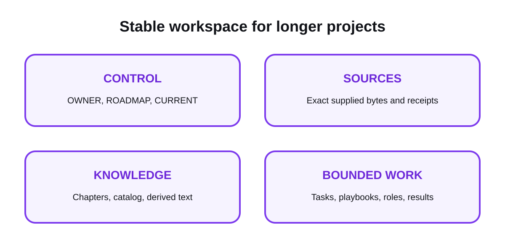

# Workspace

[Overview](../README.md) · [Get started](start-here.md) · [How it works](how-it-works.md) · [Workspace](workspace.md) · [Commands](commands.md) · [Security](security.md) · [All guides](README.md)

The workspace is a **Stable, optional** route for longer projects. It is not
required for the core `init → preview → pack → inspect → verify` flow. It adds
structure for sources, reviewed knowledge, bounded tasks, and recovery evidence
without turning OPENCNTX into a cloud service, AI platform, or automatic agent.

<picture>
  <source media="(prefers-color-scheme: dark)" srcset="../assets/docs/workspace-map-dark.svg">
  
</picture>

## Create a workspace

```powershell
opencntx workspace init my-project
```

The command creates a new directory and refuses to overwrite a non-empty one.

```text
my-project/
├── opencntx.toml
├── CONTROL/
│   ├── OWNER.md
│   ├── ROADMAP.md
│   └── CURRENT.md
├── SOURCES/
├── CHAPTERS/
├── TASKS/
├── PLAYBOOKS/
├── ROLES/
└── .opencntx/
    └── lifecycle/
        └── state.json
```

New local workspace files are created with private owner permissions where the
operating system exposes that control. Existing compatible version-1
workspaces remain readable without a lifecycle sidecar.

## Refresh the compact control snapshot

A new workspace includes one marked current block in `CONTROL/ROADMAP.md`.
After editing that official block, run:

```powershell
opencntx workspace control refresh --root my-project
```

This creates or refreshes `.opencntx/control-snapshot.md`. The full roadmap
digest remains pinned. OPENCNTX does not write roadmap decisions or summarize
them with AI.

## Capture one supplied source

```powershell
opencntx workspace capture README.md `
  --root my-project `
  --origin OWNER `
  --privacy PRIVATE
```

The capture flow:

- reads one regular local file;
- rejects directories, devices, symlinks, and managed internal paths;
- stores exact bytes under a generated source ID;
- records origin, privacy label, size, and SHA-256;
- omits the original absolute path from the official record;
- returns a receipt.

New sources default to `PRIVATE`. Labels are classification, not encryption.

## Diagnose and recover interrupted writes

Every official writer uses a local transaction. A workspace-level lock protects
shared source, catalog, control, definition, media, and package state. A task
lock protects an exact append-only task chain. Task-bound shared operations take
the workspace lock before the task lock; writers do not wait, steal stale locks,
or retry automatically.

Read current transaction health without changing the workspace:

```powershell
opencntx workspace doctor --root my-project
```

Healthy completed transactions are retained as small evidence records. An
active writer is reported as `ACTIVE`. A crashed writer leaves
`RECOVERY_REQUIRED` with the exact transaction ID and intent SHA-256.

Preview exact recovery first:

```powershell
opencntx workspace recover --root my-project --transaction TXN-ID --intent-sha256 SHA256
```

Only the same command with `--apply` changes state. It refuses an active writer
or changed/unknown state, creates and verifies a retained backup, rolls the
known targets back to their previous exact state, and writes a recovery receipt.
Recovery does not grant task, result, publication, or OWNER authority.

## Record objective failed attempts

After context and one executor package are prepared, a failed external action
can be recorded with `workspace task record-attempt`. The command never runs or
retries that action. It requires:

- the exact executor ID and one effective allowed action;
- one command type and canonical workspace-relative target;
- one or more relevant workspace input files, hashed by OPENCNTX;
- an exit status and fixed normalized error class;
- bounded recorded action and duration values;
- one local result-evidence file;
- changed relevant input bytes or unique new evidence after the first attempt.

OPENCNTX copies evidence under the task, derives the fingerprint and basis
digest, sums all task-wide budgets, and publishes evidence plus event under the
existing task transaction. Three equal fingerprints, five total attempts, 25
actions, or 30 minutes block the task. Status explains the exact reason without
printing evidence contents. These are reproducible local records, not an
automatic truth check or cryptographic identity proof.

## What comes next

Captured sources do not automatically become accepted knowledge or task
context. The normal order is:

1. capture a source;
2. create and review a chapter;
3. rebuild the catalog;
4. register and approve any needed playbook and role;
5. propose and approve one task;
6. build and verify task context;
7. prepare at most one bounded executor package;
8. submit, review, accept, and close the result.

## Storage boundaries

- Original sources stay separate from derived text.
- Official records stay separate from replaceable indexes.
- Append-only task events are never treated as editable status files.
- A source hash does not grant OWNER approval.
- No workspace command starts an AI, agent, OCR tool, or external sync.

## Audit and maintain the local lifecycle

`workspace lifecycle status` is a read-only inventory of observed operating-
system permissions, privacy-label counts, storage categories, compatibility,
and migration state. It reports source aliases and digests, never original
capture paths or content.

Migration only registers unchanged compatible version-1 records in a new
sidecar. Cleanup is never automatic: it accepts only named replaceable or
completed local artifacts, requires a previewed digest-bound plan, and creates
a verified checkpoint outside the workspace before removing anything. Restore
requires that checkpoint's exact SHA-256. Both operations use the existing
single-writer transaction and compare-and-swap boundary.

Permission results describe only what OPENCNTX could observe. They do not add
encryption, authentication, team identities, or backup policy. See [Privacy,
storage, and format lifecycle](privacy-storage-lifecycle.md) for the exact
profiles, targets, and stop conditions.

## Related pages

- [Chapters and catalog](chapters-and-catalog.md)
- [Context navigation](context-navigation.md)
- [Media and derived text](media.md)
- [Privacy, storage, and format lifecycle](privacy-storage-lifecycle.md)
- [OWNER flow](owner-flow.md)
- [Security](security.md)

[Documentation home](README.md)
